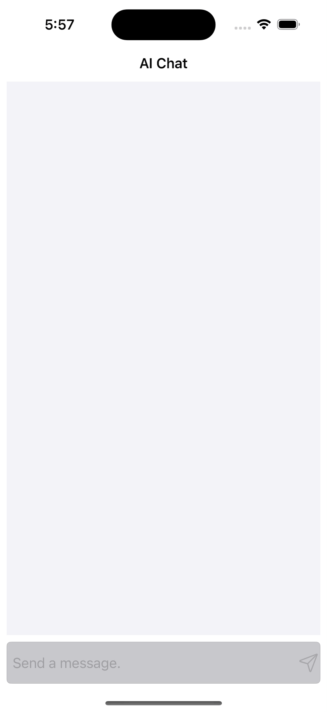

# **Chatbot**

## **소개**

이 앱은 OpenAI에서 개발한 GPT-3.5-turbo 모델을 활용하여 만든 iOS용 챗봇 앱입니다. 이 앱은 사용자의 질문에 대해 적절한 답변을 제공합니다. 사용자가 입력한 텍스트를 GPT 모델에 전달하여 모델이 생성한 텍스트를 답변으로 제공합니다.

## **기능**

- 텍스트 입력을 통한 대화
- OpenAI의 GPT 모델을 사용하여 자연스러운 대화 가능
- 답변을 보내는 중임을 알리는 로딩 인디케이터
- 대화 기록을 테이블뷰로 확인 가능

## **개발환경**
- Xcode 14.3
- Swift 5.8
- UIKit 프레임워크
- OpenAI gpt-3.5-turbo 모델

## **사용 방법**

1. 이 저장소를 클론하여 프로젝트를 실행합니다.
2. `OpenAIAPI.swift` 파일을 열고 `YOUR API KEY` 부분을 자신의 API 키로 수정합니다.
3. 앱을 실행합니다.
4. 텍스트 필드에 질문을 입력하고 Send버튼을 누릅니다.
5. 답변이 나올 때까지 대기합니다.
6. 로딩 인디케이터가 사라지면 답변이 테이블뷰에 출력됩니다.

## **실행 화면**

